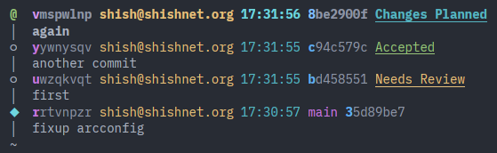

# JJ Forge Integration

Because I'm regularly using github, gerrit, and phabricator, and I don't like any of their standard `git` workflows (and then I go ahead and use `jj`, which has *much* better client-side UX, but the forge integrations are even less-well-supported...)

I really just want `jj pr rebase` to bring me up to date with remote changes, and `jj pr submit` to submit my local changes for review - automatically Doing The Right Thing (eg updating existing reviews vs creating new ones), working consistently across forges.

As a bonus, `jj pr list` to get a list of my open reviews, and `jj pr log` to get `jj log` output annotated with review status.



## Stability Notice

Right now I'm very much building this for myself, and I haven't settled on exactly what the interface should look like, so parts may change. (eg as I write this I'm also renaming push/pull to submit/rebase to avoid overloading common terms)

## Features

* `jj pr rebase` - rebase the current stack on top of remote trunk
  * `jj pr rebase --all` - rebase all local stacks on top of remote trunk
* `jj pr submit` - submit current stack to the forge
  * runs pre-commit hooks for each commit in the stack (if configured) 
  * updates existing PR/CRs/Diffs if they exist
  * creates new ones if not
    * gerrit will create a change for each commit, mapping JJ Change ID to Gerrit Change ID
    * phabricator will create a review for each commit, updating the commit message with a phabricator footer referencing the Phabricator Revision ID
    * github will create a new `pr/XYZ` branch, send that branch for review, and update that branch on subsequent submits
* `jj pr list` - list the status of my open PRs/CRs/Diffs
* `jj pr log` - show `jj log` output annotated with review status
* `jj pr pre-commit` - run pre-commit hooks on all commits in the current stack
  * `jj pr pre-commit <change id>` - run pre-commit hooks on a specific change
* `jj pr checkout <pr/cr/diff>` - pull a specific PR/CR/Diff from the forge

## Workflow

* `jj pr rebase --all` - start the day by pulling remote changes and rebasing all my local stacks on top of them
* `jj pr list` / `jj pr log` - check for any reviews which need attention

### If I want to work on a new feature

* `jj new 'trunk()'` - create a new branch off of trunk (ie, `main` or `master`)
* `vim ...` - make some changes
* `jj commit` - commit the first unit of work
* `vim ...` - make more changes
* `jj commit` - commit the next unit of work
* `jj pr submit` - submit the two commits for review

### If any of my code needs to be changed based on feedback

* `jj edit <change id>` - switch to the change that needs to be updated
* `vim ...` - make the changes
* `jj pr submit -m 'fixed the bugs'` - submit an updated version of the commit for review, with a comment listing what changed since last time

#### If I want to test somebody else's code

* `jj pr checkout <pr/cr/diff>` - pull a specific PR/CR/Diff from the forge

## Backend Notes

Backend will be automatically detected based on the git remote URL; if that doesn't work, you can set the backend explicitly with `jj config set --repo pr.forge <backend>`.
 
* [github](./src/jjpr/forges/github/README.md)
* [gerrit](./src/jjpr/forges/gerrit/README.md)
* [phabricator](./src/jjpr/forges/phabricator/README.md)

## Install

```sh
git clone https://github.com/shish/jj-pr
cd jj-pr
uv sync
jj config set --user aliases.pr "['util', 'exec', '--', '$(pwd)/.venv/bin/jj-pr']"

# if you want to be hacking on jj-pr itself
uv run prek install
```

## Integration Testing

```bash
docker compose up -d
docker compose ps    # wait and repeat until containers are healthy

# Create admin user, get a token from settings
open "http://gerrit.localhost:8080/settings/#HTTPCredentials"
export JJPR_TEST_GERRIT_API_TOKEN=...

# Create admin user, get a token from settings
open "http://phab.localhost:8081/settings/user/admin/page/apitokens/"
export JJPR_TEST_PHABRICATOR_API_TOKEN=...
open "http://phab.localhost:8081/settings/user/admin/page/vcspassword/"
export JJPR_TEST_PHABRICATOR_VCS_PASSWORD=...

# Create admin user, get a token from settings
open "http://gitea.localhost:8082/user/settings/applications"
export JJPR_TEST_GITEA_API_TOKEN=...

# Run tests against the above forges
uv run pytest -v --no-cov tests/integration

# Delete test environment
docker compose down -v
```
